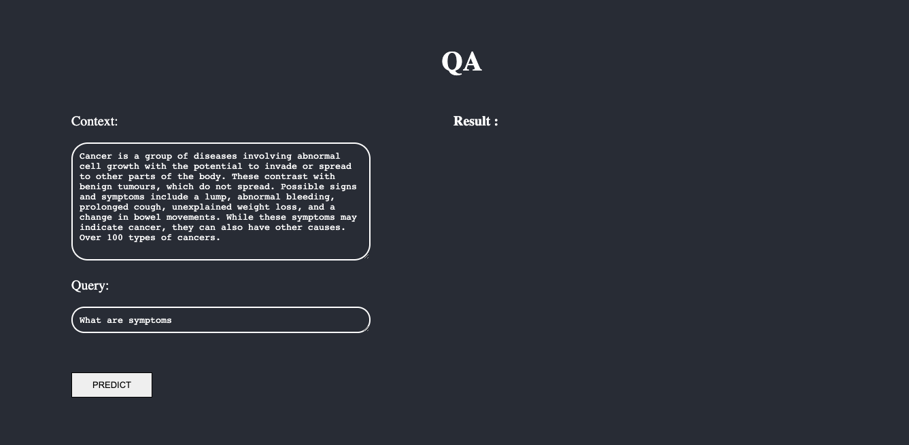
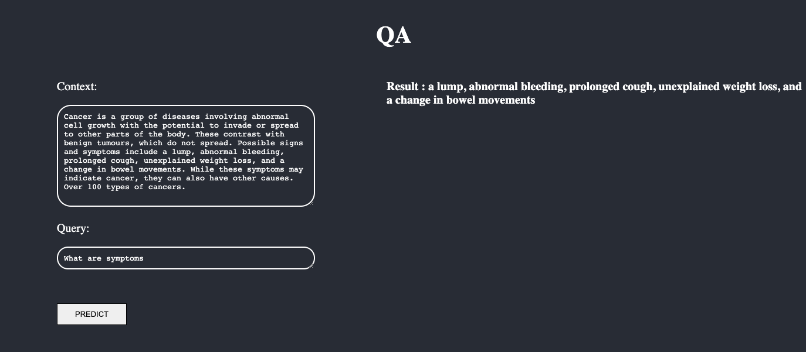

Question Answering has become one of the most important problems in modern NLP research. In this project, I have tried to implement a Q and A system using 3 Different models, fine-tuned on SQuAD_2.0(Stanford Question and Answering Dataset)

# Tools:

Tensorflow(v2.1.0)

Keras(v3.0)

Huggingface's Transformer library
(Note : Huggingface does not have a question and answering head for RoBERTa in Tensorflow. I have used a custom QA_head in this projet which will be described with the architecture)

Huggingface's Tokenizer library

Numpy

Pandas

Logging

# Stanford Question and Answering Dataset (SQuAD):
The Data consists of multiple titles, each having multiple contexts/documents, each context having multiple questions and answers. Each answer is provided with the start index. The questions can be seen as queries to each passage and the answers can be seen as a span in each context.
.I have used the dataset from https://www.kaggle.com/parthplc/squad-20-csv-file

# Task:
Given a question and corresponding context, predict the span of the answer in the context using a start and end logit.

# Creating Input Features:
While training, the goal is to first create start and end logits for each context for a particular question. The start index is already given and using the length of the answer, the end index is determined.

We then make a mask(list) which is the size of the context. Those positions which contain the answer are given the value of 1 whereas others are given the value of 0.

The next step is to create offsets for each token in the context and appending those tokens whose offset span contain ones to a list. This list now contains the tuples holding the positions of those tokens present in the answer.
Thus, the start token becomes the first tuple in the list whereas the end token becomes the last tuple in the list.

# Model:
 
The models taken into consideration are:

    "deepsetroberta-base-squad2" 

    "bert-large-uncased-whole-word-masking-finetuned-squad"

    "ahotrod/electra_large_discriminator_squad2_512"
 

# Results:

# EXTENDING WORK: Question Answering on Wikipedia pages
I wanted to start with something simple and general, so i planned to make it open domain, using Wikipedia as a corpus for answering questions
and used it the corpus to give answers to common questions like:
    
    'Why is the sky blue?',

    'How many sides does a pentagon have?'

These questions can be fed in the form of command line arguments too if needed.